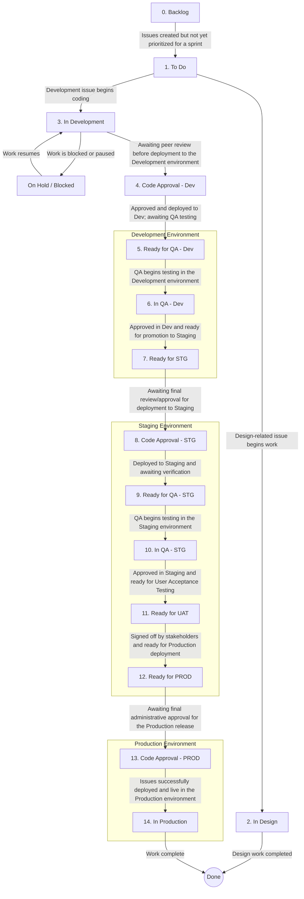

# Scrum Workflow

This repo contains the working version of the team's scrum ticket status workflow.

## Status Flow

```mermaid
flowchart TD
    B["0. Backlog"] -->|"Issues created but not yet prioritized for a sprint"| T["1. To Do"]

    T -->|"Design-related issue begins work"| D["2. In Design"]
    D -->|"Design work completed"| DONE(("Done"))

    T -->|"Development issue begins coding"| DEV["3. In Development"]
    DEV -->|"Work is blocked or paused"| HOLD["On Hold / Blocked"]
    HOLD -->|"Work resumes"| DEV

    DEV -->|"Awaiting peer review before deployment to the Development environment"| CADEV["4. Code Approval - Dev"]

    subgraph DE["Development Environment"]
        direction TB
        RQAD["5. Ready for QA - Dev"] -->|"QA begins testing in the Development environment"| IQAD["6. In QA - Dev"]
        IQAD -->|"Approved in Dev and ready for promotion to Staging"| RSTG["7. Ready for STG"]
    end

    CADEV -->|"Approved and deployed to Dev; awaiting QA testing"| RQAD

    subgraph SE["Staging Environment"]
        direction TB
        CASTG["8. Code Approval - STG"] -->|"Deployed to Staging and awaiting verification"| RQAS["9. Ready for QA - STG"]
        RQAS -->|"QA begins testing in the Staging environment"| IQAS["10. In QA - STG"]
        IQAS -->|"Approved in Staging and ready for User Acceptance Testing"| RUAT["11. Ready for UAT"]
        RUAT -->|"Signed off by stakeholders and ready for Production deployment"| RPROD["12. Ready for PROD"]
    end

    RSTG -->|"Awaiting final review/approval for deployment to Staging"| CASTG

    subgraph PE["Production Environment"]
        direction TB
        CAPROD["13. Code Approval - PROD"] -->|"Issues successfully deployed and live in the Production environment"| IPROD["14. In Production"]
    end

    RPROD -->|"Awaiting final administrative approval for the Production release"| CAPROD
    IPROD -->|"Work complete"| DONE
```
