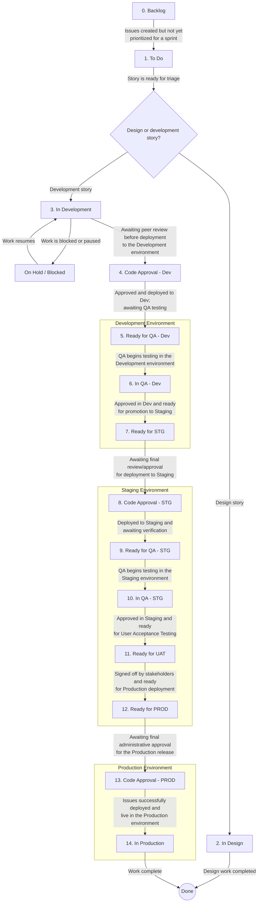

# Original Story Status Workflow

Original scrum ticket lifecycle with a design-vs-development decision branch.

```mermaid
flowchart TD
    B["0. Backlog"] -->|"Issues created but not yet<br/>prioritized for a sprint"| T["1. To Do"]

    T -->|"Story is ready for triage"| DEC{"Design or development story?"}

    DEC -->|"Design story"| D["2. In Design"]
    D -->|"Design work completed"| DONE(("Done"))

    DEC -->|"Development story"| DEV["3. In Development"]
    DEV -->|"Work is blocked or paused"| HOLD["On Hold / Blocked"]
    HOLD -->|"Work resumes"| DEV

    DEV -->|"Awaiting peer review before deployment<br/>to the Development environment"| CADEV["4. Code Approval - Dev"]

    subgraph DE["Development Environment"]
        direction TB
        RQAD["5. Ready for QA - Dev"] -->|"QA begins testing in the<br/>Development environment"| IQAD["6. In QA - Dev"]
        IQAD -->|"Approved in Dev and ready<br/>for promotion to Staging"| RSTG["7. Ready for STG"]
    end

    CADEV -->|"Approved and deployed to Dev;<br/>awaiting QA testing"| RQAD

    subgraph SE["Staging Environment"]
        direction TB
        CASTG["8. Code Approval - STG"] -->|"Deployed to Staging and<br/>awaiting verification"| RQAS["9. Ready for QA - STG"]
        RQAS -->|"QA begins testing in the<br/>Staging environment"| IQAS["10. In QA - STG"]
        IQAS -->|"Approved in Staging and ready<br/>for User Acceptance Testing"| RUAT["11. Ready for UAT"]
        RUAT -->|"Signed off by stakeholders and ready<br/>for Production deployment"| RPROD["12. Ready for PROD"]
    end

    RSTG -->|"Awaiting final review/approval<br/>for deployment to Staging"| CASTG

    subgraph PE["Production Environment"]
        direction TB
        CAPROD["13. Code Approval - PROD"] -->|"Issues successfully deployed and<br/>live in the Production environment"| IPROD["14. In Production"]
    end

    RPROD -->|"Awaiting final administrative approval<br/>for the Production release"| CAPROD
    IPROD -->|"Work complete"| DONE
```
