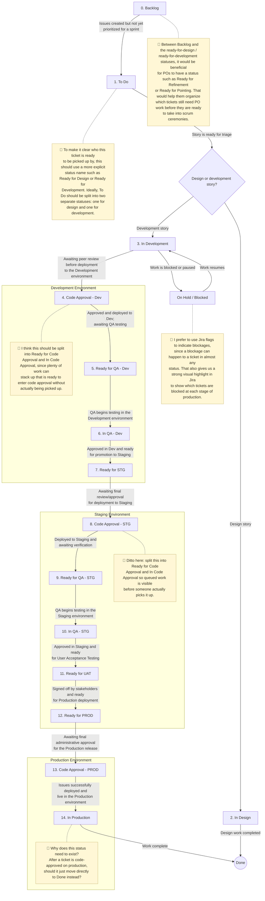

# Original Workflow Commentary

Commentary copy of the original workflow for annotations and optimization notes.

```mermaid
flowchart TD
    B["0. Backlog"] -->|"Issues created but not yet<br/>prioritized for a sprint"| T["1. To Do"]
    B -.- NOTE_B["💬 Between Backlog and the ready-for-design /<br/>ready-for-development statuses, it would be beneficial<br/>for POs to have a status such as Ready for Refinement<br/>or Ready for Pointing. That would help them organize<br/>which tickets still need PO work before they are ready<br/>to take into scrum ceremonies."]
    T -.- NOTE_T["💬 To make it clear who this ticket is ready<br/>to be picked up by, this should use a more explicit<br/>status name such as Ready for Design or Ready for<br/>Development. Ideally, To Do should be split into two<br/>separate statuses: one for design and one for development."]

    T -->|"Story is ready for triage"| DEC{"Design or development story?"}

    DEC -->|"Design story"| D["2. In Design"]
    D -->|"Design work completed"| DONE(("Done"))

    DEC -->|"Development story"| DEV["3. In Development"]
    DEV -->|"Work is blocked or paused"| HOLD["On Hold / Blocked"]
    HOLD -.- NOTE_HOLD["💬 I prefer to use Jira flags to indicate blockages,<br/>since a blockage can happen to a ticket in almost any<br/>status. That also gives us a strong visual highlight in Jira<br/>to show which tickets are blocked at each stage of production."]
    HOLD -->|"Work resumes"| DEV
    DEV -->|"Awaiting peer review before deployment<br/>to the Development environment"| CADEV["4. Code Approval - Dev"]

    subgraph DE["Development Environment"]
        direction TB
        CADEV -.- NOTE_CADEV["💬 I think this should be split into Ready for Code<br/>Approval and In Code Approval, since plenty of work can<br/>stack up that is ready to enter code approval without<br/>actually being picked up."]
        RQAD["5. Ready for QA - Dev"] -->|"QA begins testing in the<br/>Development environment"| IQAD["6. In QA - Dev"]
        IQAD -->|"Approved in Dev and ready<br/>for promotion to Staging"| RSTG["7. Ready for STG"]
    end

    CADEV -->|"Approved and deployed to Dev;<br/>awaiting QA testing"| RQAD

    subgraph SE["Staging Environment"]
        direction TB
        CASTG["8. Code Approval - STG"] -->|"Deployed to Staging and<br/>awaiting verification"| RQAS["9. Ready for QA - STG"]
        CASTG -.- NOTE_CASTG["💬 Ditto here: split this into Ready for Code<br/>Approval and In Code Approval so queued work is visible<br/>before someone actually picks it up."]
        RQAS -->|"QA begins testing in the<br/>Staging environment"| IQAS["10. In QA - STG"]
        IQAS -->|"Approved in Staging and ready<br/>for User Acceptance Testing"| RUAT["11. Ready for UAT"]
        RUAT -->|"Signed off by stakeholders and ready<br/>for Production deployment"| RPROD["12. Ready for PROD"]
    end

    RSTG -->|"Awaiting final review/approval<br/>for deployment to Staging"| CASTG

    subgraph PE["Production Environment"]
        direction TB
        CAPROD["13. Code Approval - PROD"] -->|"Issues successfully deployed and<br/>live in the Production environment"| IPROD["14. In Production"]
        IPROD -.- NOTE_IPROD["💬 Why does this status need to exist?<br/>After a ticket is code-approved on production,<br/>should it just move directly to Done instead?"]
    end

    RPROD -->|"Awaiting final administrative approval<br/>for the Production release"| CAPROD
    IPROD -->|"Work complete"| DONE

    classDef note fill:#fff7d6,stroke:#c8b26a,color:#3a3320,stroke-width:1px;
    class NOTE_B,NOTE_T,NOTE_HOLD,NOTE_CADEV,NOTE_CASTG,NOTE_IPROD note;
```
