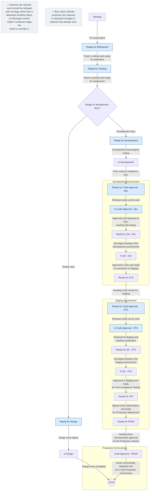
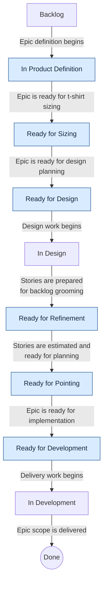

# Proposed Story Status Workflow

Proposed workflow that incorporates the commentary and highlights changed statuses as proposed edits.

## Story Workflow

```mermaid
flowchart TD
    NOTE_FLAGS["💬 General rule: blocked work should be indicated<br/>with Jira flags rather than a dedicated workflow status,<br/>so blockages remain visible in whatever stage the<br/>ticket is currently in."]
    NOTE_PROPOSED["💬 Blue nodes indicate proposed new statuses<br/>or proposed changes to statuses that already exist."]

    B["Backlog"] -->|"PO prep begins"| RFR["Ready for Refinement"]
    RFR -->|"Ticket is refined and ready for estimation"| RFP["Ready for Pointing"]
    RFP -->|"Ticket is pointed and ready for assignment"| DEC{"Design or development story?"}

    DEC -->|"Design story"| RFD["Ready for Design"]
    RFD -->|"Design work begins"| D["In Design"]
    D -->|"Design work completed"| DONE(("Done"))

    DEC -->|"Development story"| RFDV["Ready for Development"]
    RFDV -->|"Development issue begins coding"| DEV["In Development"]
    DEV -->|"Peer review is needed in Dev"| RCADEV["Ready for Code Approval - Dev"]

    subgraph DE["Development Environment"]
        direction TB
        RCADEV -->|"Reviewer picks up the work"| ICADEV["In Code Approval - Dev"]
        ICADEV -->|"Approved and deployed to Dev;<br/>awaiting QA testing"| RQAD["Ready for QA - Dev"]
        RQAD -->|"QA begins testing in the<br/>Development environment"| IQAD["In QA - Dev"]
        IQAD -->|"Approved in Dev and ready<br/>for promotion to Staging"| RSTG["Ready for STG"]
    end

    RSTG -->|"Awaiting code review for Staging"| RCASTG["Ready for Code Approval - STG"]

    subgraph SE["Staging Environment"]
        direction TB
        RCASTG -->|"Reviewer picks up the work"| ICASTG["In Code Approval - STG"]
        ICASTG -->|"Deployed to Staging and<br/>awaiting verification"| RQAS["Ready for QA - STG"]
        RQAS -->|"QA begins testing in the<br/>Staging environment"| IQAS["In QA - STG"]
        IQAS -->|"Approved in Staging and ready<br/>for User Acceptance Testing"| RUAT["Ready for UAT"]
        RUAT -->|"Signed off by stakeholders and ready<br/>for Production deployment"| RPROD["Ready for PROD"]
    end

    subgraph PE["Production Environment"]
        direction TB
        CAPROD["Code Approval - PROD"] -->|"Issues successfully deployed and<br/>live in the Production environment"| DONE
    end

    RPROD -->|"Awaiting final administrative approval<br/>for the Production release"| CAPROD

    classDef proposed fill:#d9ecff,stroke:#5a84b6,color:#11263f,stroke-width:1.5px;
    classDef note fill:#eef2f5,stroke:#b8c2cc,color:#2d3a45,stroke-width:1px;
    class RFR,RFP,RFD,RFDV,RCADEV,ICADEV,RCASTG,ICASTG proposed;
    class NOTE_FLAGS,NOTE_PROPOSED note;
```

## Epic Workflow

```mermaid
flowchart TD
    EB["Backlog"] -->|"Epic definition begins"| EPD["In Product Definition"]
    EPD -->|"Epic is ready for t-shirt sizing"| ERS["Ready for Sizing"]
    ERS -->|"Epic is ready for design planning"| ERFD["Ready for Design"]
    ERFD -->|"Design work begins"| EID["In Design"]
    EID -->|"Stories are prepared<br/>for backlog grooming"| ERR["Ready for Refinement"]
    ERR -->|"Stories are estimated and<br/>ready for planning"| ERP["Ready for Pointing"]
    ERP -->|"Epic is ready for implementation"| ERDV["Ready for Development"]
    ERDV -->|"Delivery work begins"| EDEV["In Development"]
    EDEV -->|"Epic scope is delivered"| EDONE(("Done"))

    classDef proposed fill:#d9ecff,stroke:#5a84b6,color:#11263f,stroke-width:1.5px;
    class EPD,ERS,ERFD,ERR,ERP,ERDV proposed;
```
